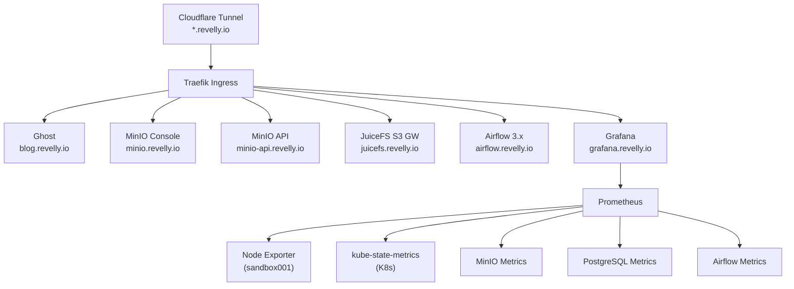

# k8s-infra

홈서버 Kubernetes 인프라 구성.

## 아키텍처



### 스토리지 구조

```
MinIO (S3 오브젝트 스토리지)
  └── juicefs 버킷
        └── JuiceFS 파일시스템 (메타데이터: PostgreSQL)
              ├── SC: juicefs        (Delete, UUID subdir)
              └── SC: juicefs-retain (Retain, {namespace}/{pvc-name} subdir)
```

## 배포 순서

| 순서 | 플랫폼                 | 방식      | 의존성                 |
| ---- | ---------------------- | --------- | ---------------------- |
| 0    | Ghost                  | Kustomize | 없음                   |
| 1    | MinIO                  | Helm      | 없음                   |
| 2    | CloudNativePG Operator | Helm      | 없음                   |
| 3    | PostgreSQL             | Kustomize | CloudNativePG Operator |
| 4    | JuiceFS CSI            | Helm      | MinIO + PostgreSQL     |
| 5    | JuiceFS S3 Gateway     | Kustomize | JuiceFS CSI            |
| 6    | Airflow                | Helm      | PostgreSQL + JuiceFS   |
| 7    | Monitoring             | Helm      | 없음                   |

## 공통 설정

| 항목               | 값                                 |
| ------------------ | ---------------------------------- |
| K8s 클러스터       | k3s v1.34.3 (sandbox001)           |
| Namespace          | `sandbox`                          |
| Ingress Controller | Traefik (k3s 내장)                 |
| 외부 접근          | Cloudflare Tunnel (`*.revelly.io`) |
| 기본 StorageClass  | `local-path` (k3s 내장)            |
| 분산 StorageClass  | `juicefs` / `juicefs-retain`       |

## 디렉토리 구조

```
k8s-infra/
├── helm/
│   ├── airflow/              # Airflow 3.x (KubernetesExecutor)
│   ├── cloudnative-pg/       # CloudNativePG Operator
│   ├── juicefs-csi/          # JuiceFS CSI Driver
│   ├── monitoring/           # Prometheus + Grafana (kube-prometheus-stack)
│   └── minio/                # MinIO 오브젝트 스토리지
├── kustomize/
│   ├── ghost/                # Ghost 블로그
│   ├── juicefs-gateway/      # JuiceFS S3 Gateway
│   └── postgres/             # PostgreSQL 클러스터
└── compose/
    └── blog.yml              # (레거시)
```

## 접속 정보

| 서비스          | URL                           | 비고                           |
| --------------- | ----------------------------- | ------------------------------ |
| Ghost           | https://blog.revelly.io       | 공개 블로그                    |
| MinIO Console   | https://minio.revelly.io      | S3 관리                        |
| MinIO API       | https://minio-api.revelly.io  | S3 API 엔드포인트              |
| JuiceFS Gateway | https://juicefs.revelly.io    | JuiceFS S3 API                 |
| Airflow         | https://airflow.revelly.io    | 워크플로우 관리                |
| Grafana         | https://grafana.revelly.io    | 모니터링 대시보드              |
| Prometheus      | https://prometheus.revelly.io | Prometheus Web UI              |
| PostgreSQL      | sandbox001:30432              | NodePort, SSH 터널로 외부 접근 |
